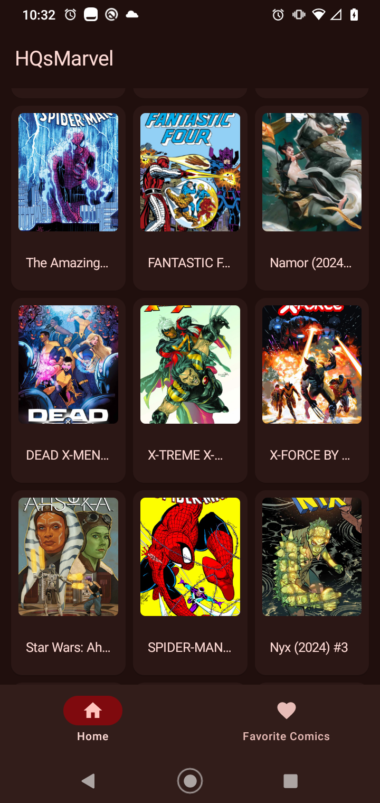
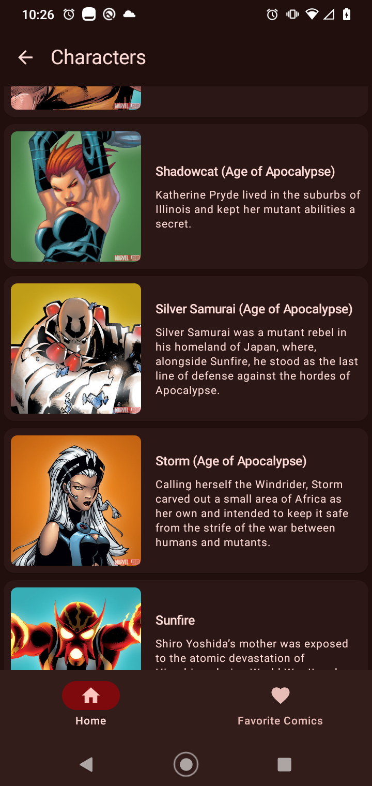
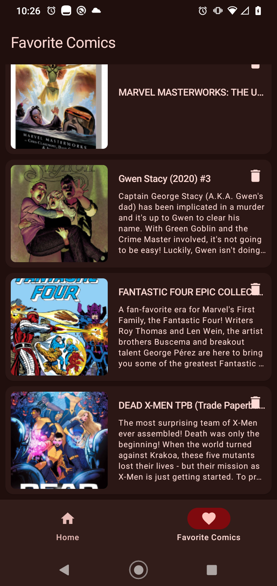

# HQsMarvel
### 
Search for your favorite comics and characters from the Marvel universe.
  
 

    
   

## Features
* Show Comics
* Save your favorite comics
* Show Characters

## Set Marvel Api
### In your local.properties set this values
* baseUrl=https://gateway.marvel.com/v1/public/
* apiPublicKey={your public key}
* apiPrivateKey={your private key}