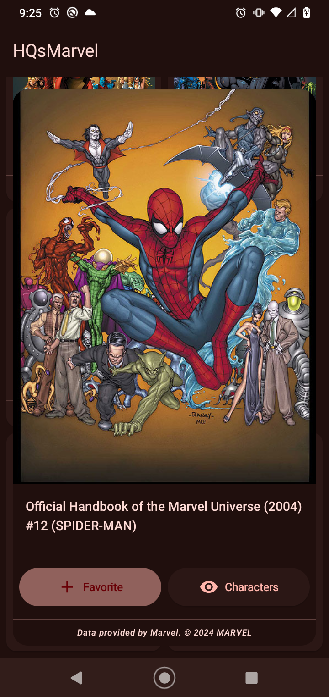

# HQsMarvel
#### 
Search for your favorite comics and characters from the Marvel universe.

 

     

## Features
* Show Comics
* Save your favorite comics
* Show Characters

## Set Marvel Api
#### In your local.properties set this values
* baseUrl=https://gateway.marvel.com/v1/public/
* apiPublicKey={your public key}
* apiPrivateKey={your private key}

 If you don't already have API keys, learn how to get them here: https://developer.marvel.com/documentation/getting_started 

## Build
#### 
You can run the debug version directly in Android Studio by selecting the debug build variant, or to build the APK from the command line and immediately install it on a running emulator or connected device, invoke:

* gradlew installDebug
#### 
To building a release version create a file named keystore.properties in the root directory of your project. This file should contain your signing information, as follows: 

* RELEASE_STORE_FILE={your store file location}
* RELEASE_STORE_PASSWORD={your store password}
* RELEASE_KEY_ALIAS={your key alias}
* RELEASE_KEY_PASSWORD={your key password}
#### 
Then you can run it directly in Android Studio by selecting the release build variant or by calling it from the command line:

* gradlew installRelease

## Versions
* Kotlin 2.0.0
* Gradle 8.7